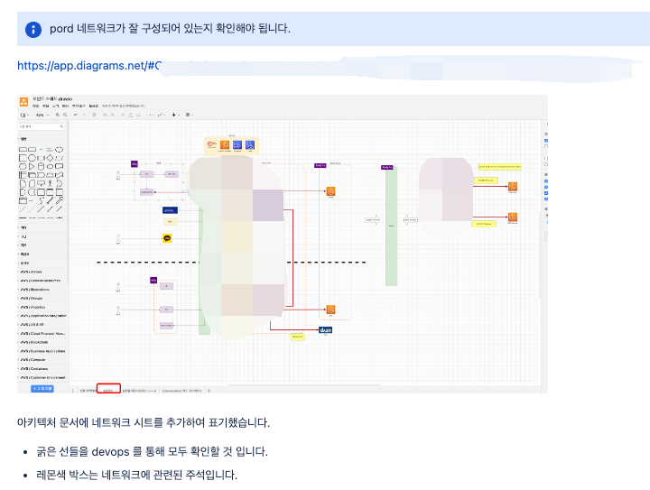
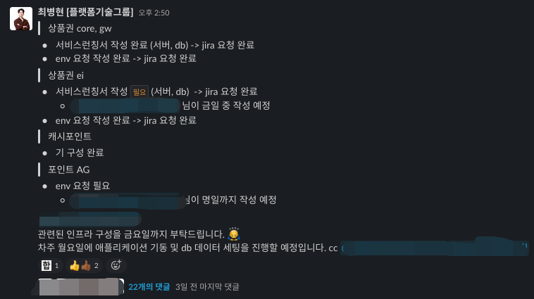

# 명시적인 분석, 기록, 위임

미들급 개발자로서 팀의 업무 속도를 높이려면 문제를 먼저 명시적으로 정리해야 한다고 생각합니다.  
흐름을 그리고, 분할해야 하는 업무는 방향과 데드라인을 함께 적어 공유하면 누락과 지연을 줄일 수 있습니다.

## 문제 분석과 흐름 정리

동시에 여러 일이 진행될 때는 먼저 문제의 흐름과 의사결정 지점을 문서화했습니다.  
구두로 합의한 내용을 다시 글로 남겨 이후 작업자가 같은 맥락에서 움직일 수 있도록 했습니다.

## 작업 분리와 위임

병렬로 진행할 수 있는 작업은 담당자, 목표, 확인 방법을 분리해 전달했습니다.  
위임은 일을 넘기는 것이 아니라, 상대가 바로 실행할 수 있을 만큼 문제를 작게 만들고 맥락을 같이 넘기는 과정이라고 생각합니다.

## 실행 기록과 후속 정리

작업이 끝난 뒤에도 결정 사항과 후속 액션을 남겨, 비슷한 문제가 다시 발생했을 때 팀이 같은 분석을 반복하지 않도록 했습니다.

