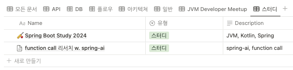
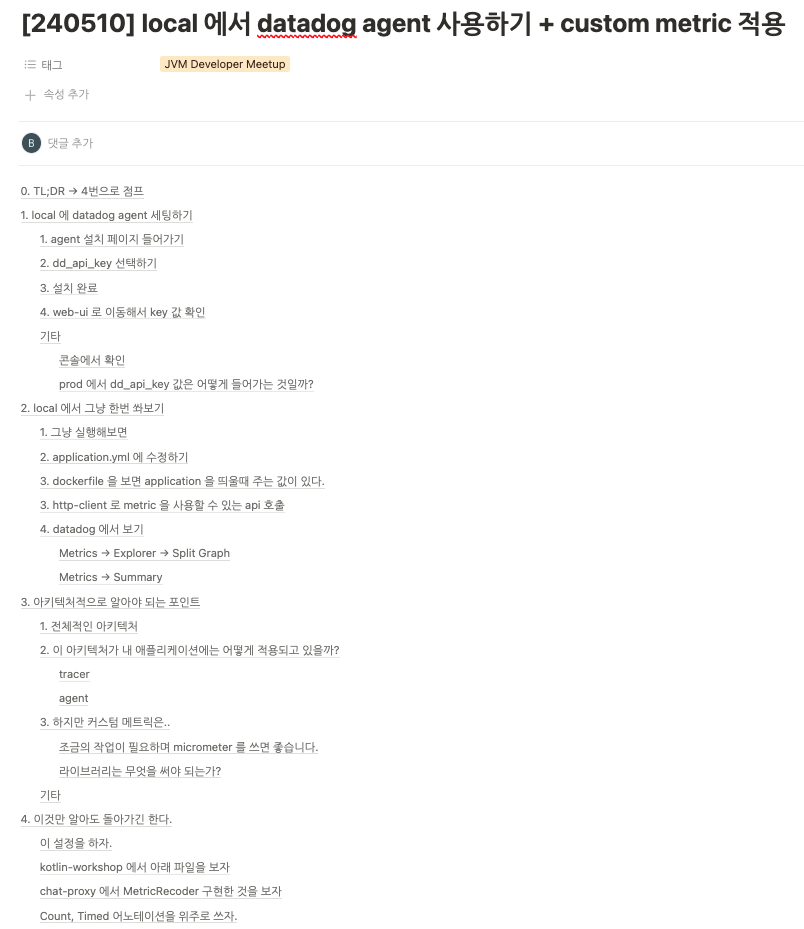
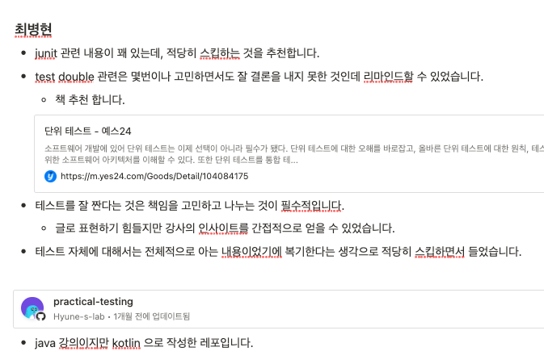
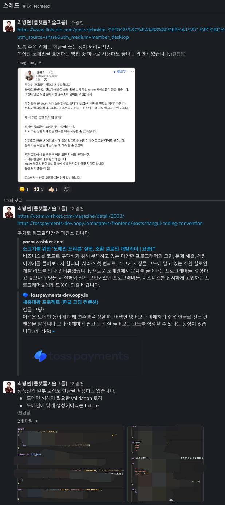

# 같이 자라기

좋은 개발자는 혼자 잘하는 것뿐 아니라, 동료가 더 빠르게 이해하고 더 안전하게 실행할 수 있는 기반을 만드는 사람이라고 생각합니다. 사내 위키, 기술 공유, 교육 세션을 통해 개인이 알고 있는 내용을 팀의 자산으로 바꾸려고 했습니다.

## 뤼튼 사내 Tech Meetup 운영

- 사내 기술 공유 문화를 만들기 위해 Tech Meetup 을 운영했습니다.
- 발표 주제와 예제를 표준화된 형태로 정리해, 발표 이후에도 문서와 샘플을 다시 참고할 수 있도록 했습니다.

## 컬리페이 사내 Wiki

컬리페이에서 상품권, 정산, 운영, 장애 대응 등 반복적으로 필요한 지식을 사내 Wiki 로 정리했습니다. 총 31건의 문서를 작성해 신규 입사자 온보딩과 운영 대응에 사용할 수 있도록 했습니다.

## 사내 공유

외부 교육에서 얻은 내용을 사내에 공유하고, 실무에 바로 연결할 수 있는 형태로 정리했습니다. 기술 공유는 단순 발표보다 이후 업무 판단에 다시 쓰일 수 있는 기록을 남기는 데 초점을 두었습니다.

