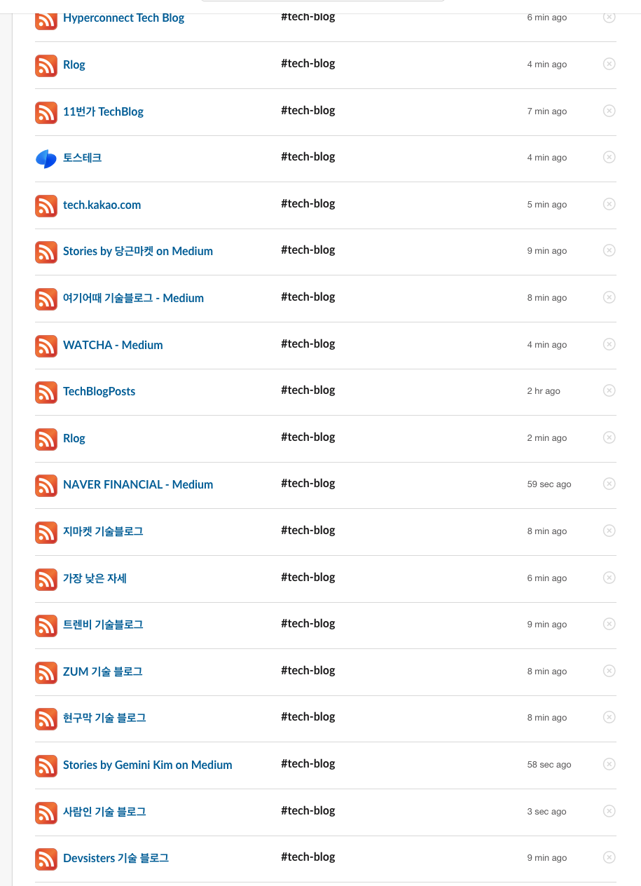
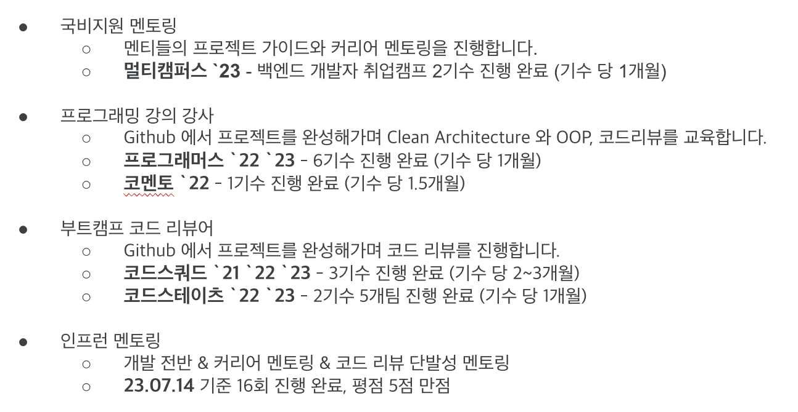
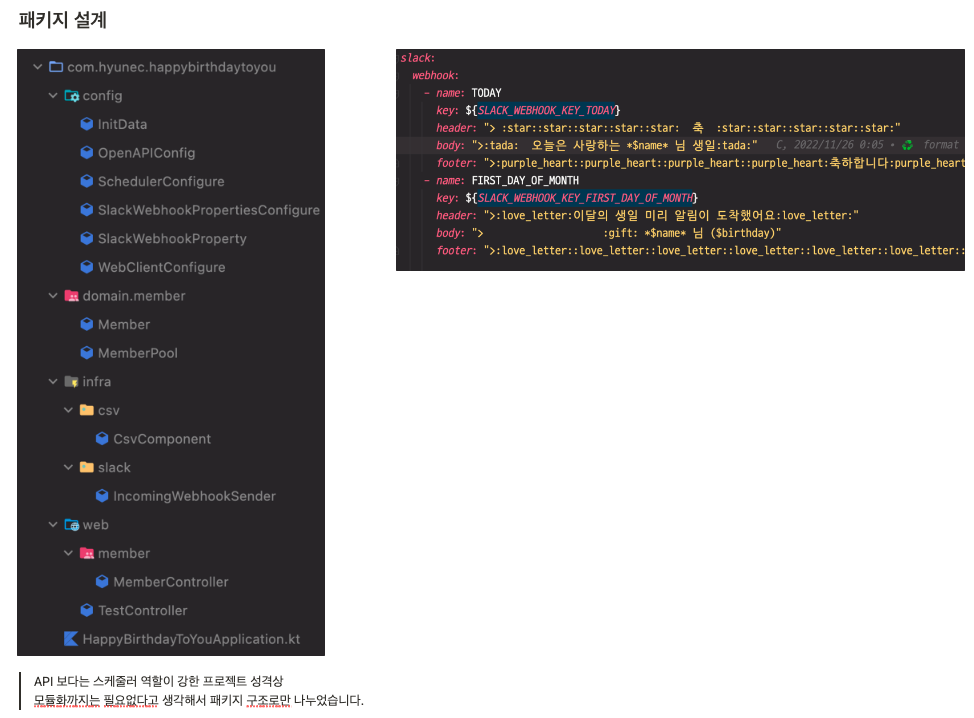
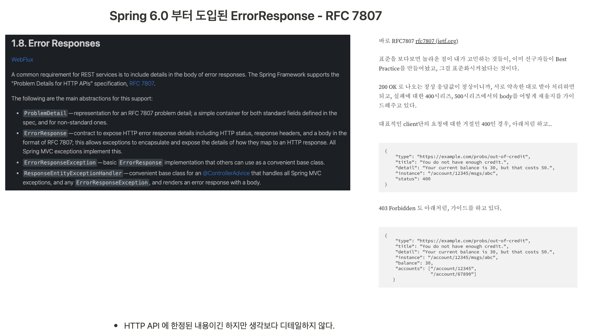
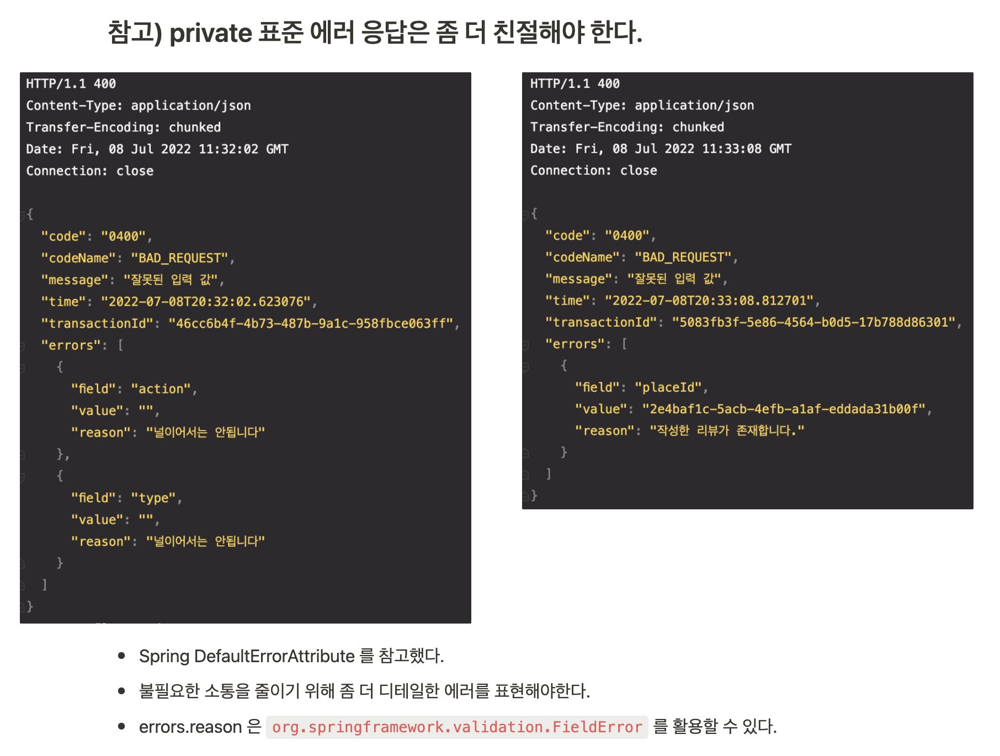

# 지속적인 활동 & 학습

개인 학습을 단순한 공부로 끝내지 않고, 실무에서 다시 사용할 수 있는 패턴과 도구로 정리하려고 노력했습니다.  
블로그, RSS, 사이드 프로젝트, 코드 리뷰, 멘토링을 통해 학습한 내용을 기록하고 검증한 뒤 실제 업무에 연결했습니다.

## RSS, 블로그, 학습

- RSS 구독과 블로그 작성을 통해 실무에 필요한 주제를 꾸준히 정리했습니다.
- Kotlin, Spring, 테스트, 아키텍처, 외부 연동처럼 업무에서 반복적으로 마주치는 주제를 개인 저장소와 글로 남겼습니다.
- 필요한 시점에 바로 꺼내 쓸 수 있도록 예제와 템플릿 형태로 정리했습니다.

## 코드 리뷰와 멘토링

- 코드 리뷰어와 멘토링 활동을 통해 다른 사람의 코드를 설명 가능한 기준으로 읽고 피드백했습니다.
- 리뷰 과정에서 반복되는 문제를 개인 학습 주제로 다시 정리하고, 이후 실무 코드 리뷰와 온보딩에도 활용했습니다.

## 실무 적용

학습한 내용을 실제 업무에 적용한 사례를 따로 정리했습니다. 개인 프로젝트에서 먼저 작게 실험한 뒤, 회사 코드베이스에 맞게 줄이거나 바꾸어 적용하는 방식을 선호합니다.

### Slack 연동 패턴

생일 축하 봇에서 사용했던 Slack 연동 패턴을 실무 알림/운영 자동화에 적용했습니다.  
작은 사이드 프로젝트에서 먼저 API 사용 방식과 메시지 구성을 검증한 뒤, 회사 환경에 맞춰 재사용했습니다.

### 표준 Error DTO

서비스 간 에러 응답 형식이 흔들리지 않도록 표준 Error DTO를 정리했습니다.  
단순한 문서화가 아니라, 예외 처리 흐름과 API 응답 스펙을 함께 맞춰 디버깅과 클라이언트 연동 비용을 줄이는 방향으로 설계했습니다.

### 기타 적용 사례

- 외부 파일 교환을 위해 AWS Transfer Family 사용 방식을 가이드했습니다.
- Kafka 기반 이벤트 소싱, CQRS, compaction 객체 설계를 학습하고 업무 설계에 반영했습니다.
- OpenFeign 의 retryer, errorDecoder, WireMock 테스트 패턴을 정리해 외부 연동 안정성을 높였습니다.
- 코루틴 기반 동시성 테스트 편의 메서드를 만들어 반복 검증 비용을 줄였습니다.

## 사이드 프로젝트

- [Hyune-s-lab](https://github.com/orgs/Hyune-s-lab/repositories): 각종 공부 자료와 실험 프로젝트를 모아둔 organization
- [kotlin-workshop](https://github.com/Hyune-s-lab/kopring-workshop): 공통으로 사용되는 기능을 템플릿화한 프로젝트
- [url-shortener](https://github.com/Hyune-s-lab/url-shortener): 요구사항 변화에 따라 구현체를 교체할 수 있도록 구성한 hexagonal architecture 기반 프로젝트
- [우리반 은행](https://github.com/Our-Class-Bank/core-backend): 용돈 관리, 신용점수 관리 프로그램. 1명의 교사와 26명의 초등학생이 실제 사용
