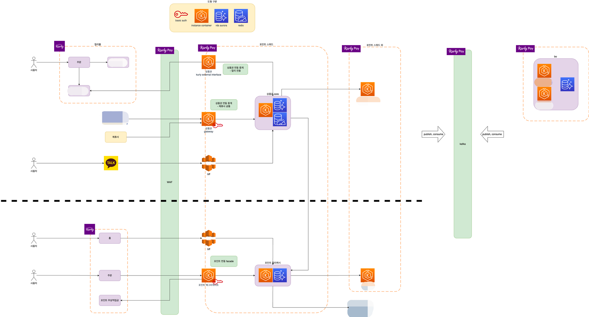
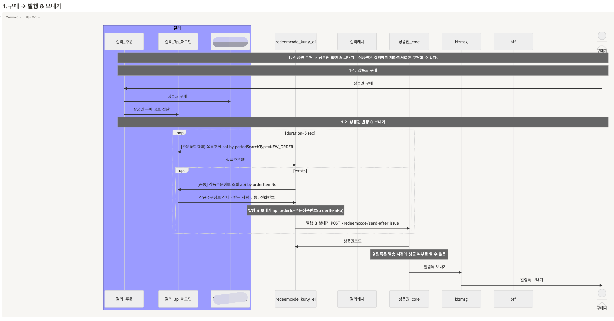

# 컬리페이 상품권 설계, 개발, 운영

상품권 설계/개발/운영을 담당하며 기획 자료 조사, 제휴사/컬리/외주 파트너사 커뮤니케이션까지 함께 수행했습니다.  
외부 제휴사용 gateway / core 서버를 분리하고, B2C 컬리몰 주문과 B2B 구매 흐름을 다르게 설계했습니다.

- 계약/상품 관계와 상품권 발행 흐름 개발
- 외부 제휴사 B2B, 컬리몰 B2C, 법인카드, 개인 대량 구매 유스케이스 지원
- 상품권 라이프사이클 Kafka 처리 설계

