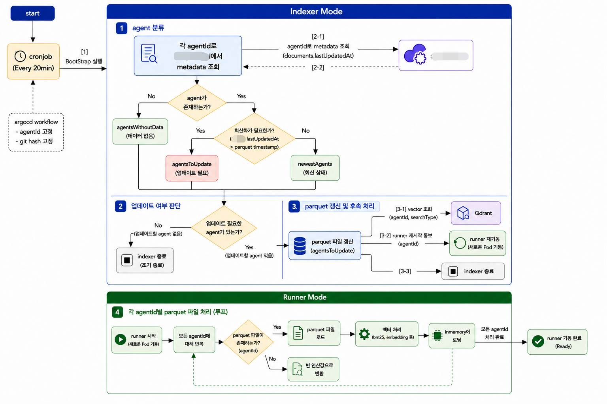
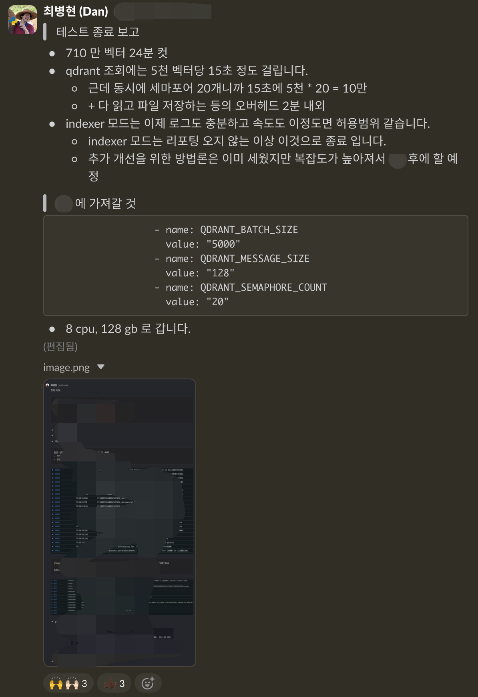

# A 은행 검색 데이터 서빙 구조 개선

## 배경

이미 프로젝트가 진행 중인 A 은행에서 대량 문서/벡터 기반 검색 데이터 서빙 안정성 검증이 필요했습니다.  
기존의 구조는 runner 부트타임에 데이터를 한 번에 준비하기 때문에, 데이터 규모 증가 시 초기화 시간과 장애 복구 시간이 운영 리스크가 되고 있었습니다.

## 성과

- Parquet 사전 생성과 `indexer-runner` 책임 분리로 runner 부트타임 부담을 줄였습니다.
- Qdrant 조회, 파일 저장, 객체 생성 구간을 분리해 병목을 관측하고 batch size / semaphore count 를 조정했습니다.
- QdrantLoader 병목, BM25 중복 초기화, CosineSimilarity 초기화 실패 원인을 확인하고 운영 파라미터를 확정했습니다.

| 구분            | 기존                  | 개선 후                                  | 성과                    |
|---------------|---------------------|---------------------------------------|-----------------------|
| Indexer 처리 시간 | 약 3시간 30분           | 약 24분                                 | 약 88.6% 단축, 약 8.8배 개선 |
| 데이터 서빙 준비 방식  | Runner 부트타임에 데이터 구성 | Indexer 가 Parquet 사전 생성               | 초기화 시간과 장애 복구 부담 완화   |
| 운영 파라미터       | 미확정                 | Batch size 5,000 / semaphore count 20 | 대량 데이터 기준 적용값 확정      |

