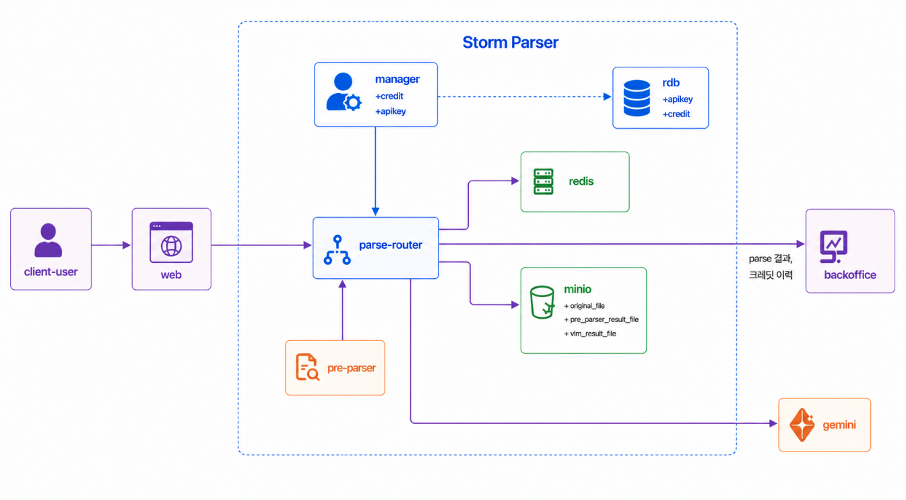
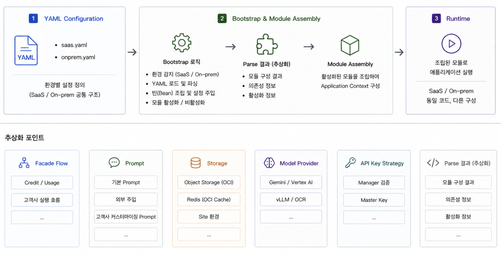

# Storm Parse APIs 개발

## 배경

Storm Parse 는 다양한 확장자의 파일을 검색과 추론에 사용할 수 있는 의미 단위로 파싱해, 에이전트 검색을 위한 지식화 과정의 핵심 전처리 데이터를 제공하는 서비스입니다.  
처음에는 내부 서비스에서만 사용하는 기능으로만 개발되었지만, Parse 기능만을 원하는 외부 고객이 생기면서 독립적인 API 상품의 니즈가 생겼습니다.

- 공개 API 로 제공하기 위해 인증, 과금, 사용량 집계, 운영 추적을 하나의 흐름으로 정리했습니다.
- 단일 SaaS 환경만 가정할 수 없었습니다. `kr`, `jp` 등 서비스 zone 이 분리되어야 했고, 고객사 환경에 설치되는 On-Prem 형태도 함께 지원해야 했습니다.
- 그래서 API spec 은 유지하면서도 실행 환경에 따라 인증 전략, 모델 Provider, 스토리지, 프롬프트 구성을 다르게 조립할 수 있는 구조가 필요했습니다.

## 성과

- 내부에서만 사용되던 문서 파싱 기능을 외부 고객이 직접 사용할 수 있는 공개 API 상품으로 확장했습니다.
    - [Storm APIs Playground](https://www.sionicstorm.ai/ko/storm-apis/playground)
    - [Storm Parse API Docs - Apidog](https://storm-apis.apidog.io/storm-parse-1618742m0)
- 250806 [테디노트 공개 세션](https://www.youtube.com/live/-7jZoe__kBE?si=Mh5kKTo9WIKuF-Sx) 일정이 잡힌 상태에서, 개발 시작 2주만에 대외 공개가 가능한
  수준으로 개발했습니다.
    - 다양한 업체의 사용 문의가 들어왔고, 회사의 메인 상품인 Storm 솔루션 외에 처음으로 SaaS 매출이 발생했습니다.
- SaaS 멀티 리전과 On-Prem 환경을 모두 고려한 실행 구조를 설계했습니다.
    - `kr`, `jp` 등 SaaS zone 분리와 동시에 N개의 On-Prem 환경을 최소한의 작업으로 지원할 수 있는 기반을 만들었습니다.

## 설계 핵심

```kotlin
// 1. profile 그룹 분리
local, dev, live, jp-live   => application-saas.yml
onprem, onprem_local        => application-onprem.yml

// 2. profile config 로 실행 전략 주입
saas {
    apiKeyStrategy = manager
    modelProvider = gemini or vllm
    storage = objectStorage + redis
}

onprem {
    apiKeyStrategy = masterKey
    modelProvider = vllm
    prompt = sitePrompt + optionalInjection
    storage = siteObjectStorage + redis
}

// 3. bootstrap 에서 config 기반 컴포넌트 조립
inferencer = resolve(app.modelProvider)
config = importBy(activeProfile)

// 4. Facade 에서 job lifecycle 제어
prepare -> preInfer -> infer -> afterInfer
jobResult -> credit.confirm() or credit.cancel()
```

- SaaS 멀티 리전과 On-Prem 환경에 따라 인증, 모델, 스토리지, 프롬프트 전략을 주입할 수 있도록 구성했습니다.
- Facade 에서 job 상태 관리를 통해 parse lifecycle 과 Credit 확정/취소 흐름을 명시적으로 제어하고, 장애 지점 식별과 과금 정합성 추적을 단순화했습니다.
- API Key 인증부터 Account / Credit / 사용량 집계까지 이어지는 end-to-end 흐름을 구현했습니다.



