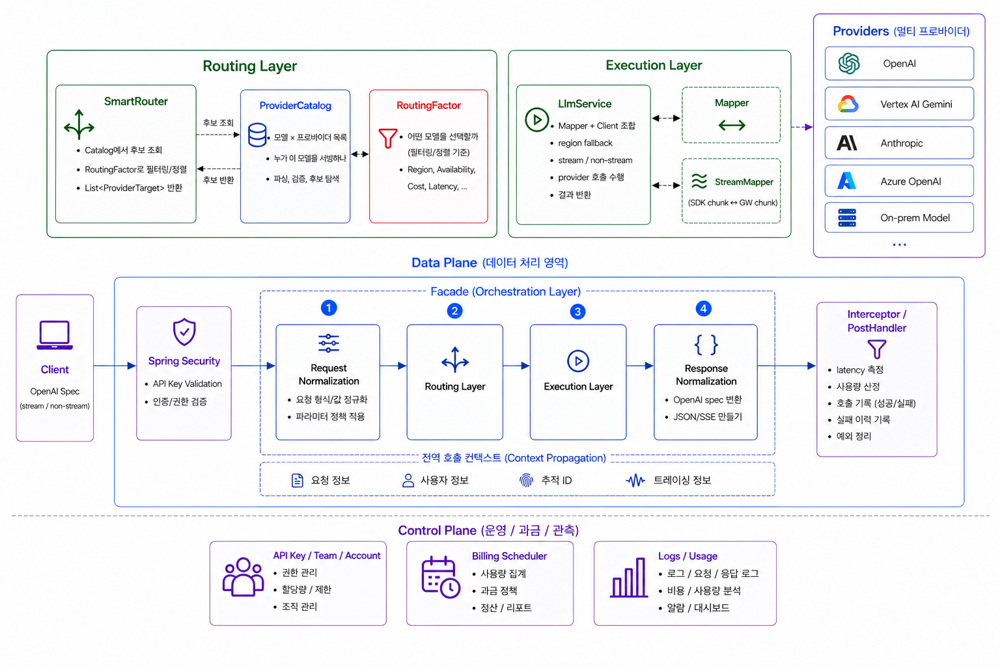
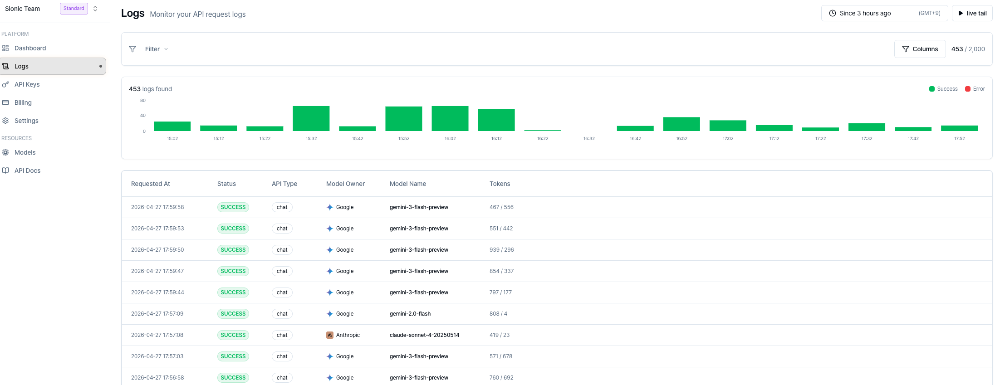
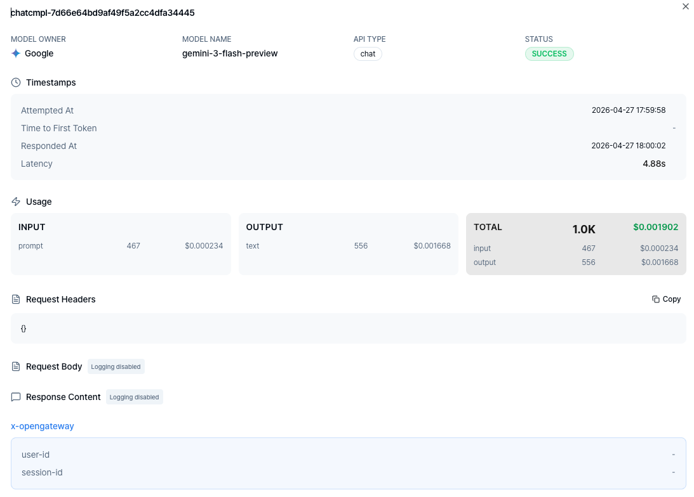
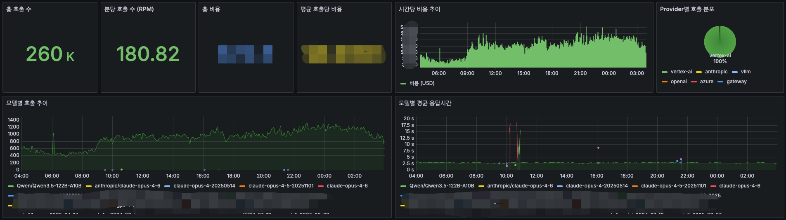
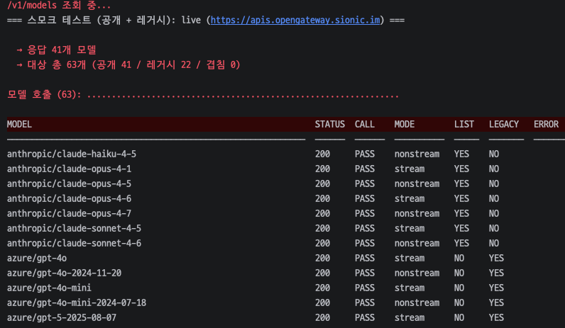

# OpenGateway 개발/운영

## 배경

[OpenGateway](https://opengateway.ai/) 는 여러 LLM Provider 를 OpenAI 호환 API 형태로 제공하기 위한 AI Gateway입니다.  
처음에는 내부 서비스에서만 사용하는 기능으로 개발되었지만, LLM routing 을 원하는 외부 고객이 생기면서 독립적인 API 상품으로 확장하는 니즈가 생겼습니다.

- SaaS / On-Prem 환경에서 모델과 Provider 가 바뀌어도 파라미터 호환성과 라우팅 품질을 유지해야 했습니다.
- `kr`, `jp` 등 zone 분리와 On-Prem 지원을 고려해, OpenAI API spec 은 유지하면서 내부 구성을 유연하게 조립할 수 있어야 했습니다.

## 성과

- 기존 내부 LLM 서빙 기능을 OpenAI 호환 공개 API Gateway 상품으로 확장하고, API Key, 인증/인가, 과금, 사용량 기록, 프론트 화면까지 모든 흐름을 구축했습니다.
- Daily 250K 수준의 트래픽, 8개 Provider, 70개 이상의 모델을 안정적으로 서빙하고 있습니다.
- Redeem Code, Admin 기능, Grafana 관측, 모델 smoke/CI/daily test 를 연결해 초기 사용자 유입과 운영 관측성, live 안정성을 함께 개선했습니다.

> 개발/운영 과정에서 활용한 AI 협업 방식과 문서화, 하네스는 [AI를 적극적으로 활용하는 개발에 대한 생각](./05_ai-development-workflow.md)에 별도로 정리했습니다.

## 설계 및 구현

- OpenAI API spec 을 유지하면서 Provider 별 요청/응답 Mapper, 토큰, 응답 포맷 차이를 Gateway 레벨에서 정규화했습니다.
- SmartRouter / LlmCatalog 기반으로 model owner 와 serving provider 를 분리하고, zone / On-Prem 환경별로 모델과 Provider 를 선택할 수 있는 라우팅
  구조를 설계했습니다.
- API Key 인증, 호출 기록, 과금, Stripe 결제, Redeem Code, Admin 기능을 구현하고 SSE streaming 로그 경로까지 보강해 공개 API 상품 운영 흐름을 구축했습니다.
- Frontend 개발과 Vercel 배포를 포함해 Auth0, Stripe, 로그/사용량 화면까지 하나의 플랫폼을 만들기 위한 기획부터 운영, 홍보까지 주니어 개발자 1명과 함께 수행했습니다.

## 운영 안정화

- 솔로 프리너 사용자를 대상으로 제품을 홍보하고 초기 사용자를 유치하며, 실제 사용 흐름을 바탕으로 개선점을 수집했습니다.
- Grafana 기반으로 트래픽, 비용, 응답 시간, Provider 분포를 관측하며 운영 상태를 관리했습니다.
- 모델 추가/제거, Provider SDK 업그레이드, API Key 교체 등 운영성 작업을 수행하며 live 환경 안정성을 유지했습니다.
- 모델 동기화, SDK 업그레이드, 릴리즈, 주간 보고 등 반복 운영 업무를 Claude Skill 로 표준화해 운영 편의성을 높였습니다.
- 70개 이상의 모델에 대해 smoke test 와 CI test 를 구성하고, CI 실행 시점과 daily job 에서 서비스 상태를 지속적으로 확인하도록 했습니다.

