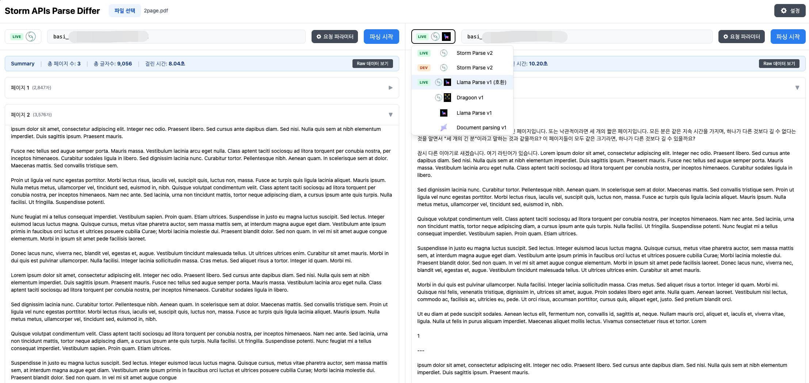

# 운영 지원 도구 개발 및 업무 표준화

## 배경

AI 활용으로 제품 개발 속도는 빨라졌지만, 서비스 간 소통 방식이나 책임 소재가 명확하지 않은 회색 영역의 업무는 누락되기 쉬웠습니다.

- API 문서, 테스트 시나리오, 운영성 도구, 에러 응답 형식이 서비스마다 제각각 다르게 관리되었습니다.
- 결제 링크 생성, 파싱 결과 비교, BO성 업무처럼 반복되지만 정식 제품 기능으로 분리되기 어려운 회색 영역의 업무가 많았습니다.

## 성과

- 결제 링크 생성, PG 가맹점/정산 관리, 파싱 결과 비교, 백오피스성 확인 업무 등을 위한 도구를 개발해 운영 편의성을 높였습니다.
- Apidog 기반 API Hub를 정착시켜 API 문서, 테스트 시나리오, 외부 공유 문서를 한 흐름으로 관리할 수 있게 했습니다.
- New Relic, 구조적 로깅, 표준 Error DTO, Skill 작성 기준을 정리하고 전파해 팀이 같은 기준으로 개발/테스트/운영할 수 있는 기반을 만들었습니다.

## 주요 기여

### API Hub와 프로덕트 테스트 흐름 표준화

- Apidog를 도입해 API 문서, 테스트 시나리오, 외부 공유 문서를 한 곳에서 관리하는 API Hub 개념을 정착시켰습니다.
- 최소 호출 시나리오를 실제 API 테스트 흐름과 연결해, 개발자와 비개발자가 같은 기준으로 API 동작을 확인할 수 있게 했습니다.

### 운영 보조 도구 개발

- 토스페이먼츠/Stripe 가맹점 등록과 정산 관리를 직접 수행했고, `onepage-payment`를 개발해 결제 링크 생성과 고객 전달을 운영자가 직접 처리할 수 있도록 했습니다.
- `storm-differ`를 개발해 Storm Parse 결과를 여러 파서/모델 기준으로 비교하고, 변경 전후 품질을 빠르게 확인할 수 있도록 했습니다.
- `BO`를 개발해 자체 기록이 없거나 저장 책임이 모호한 서비스의 반복 운영 요청을 화면과 데이터 흐름으로 처리하도록 개선했습니다.

### 운영 지원과 개발 표준화 기여

- Anthropic, OpenAI, Vertex AI, GitHub 등 외부 서비스의 API Key와 권한을 관리하며, 서비스별 접근 범위와 운영 책임을 정리했습니다.
- New Relic, `logback`, structured logging 기준을 정리해 서비스 로그와 지표를 같은 방식으로 확인할 수 있도록 했습니다.
- 표준 Error DTO를 정리해 서비스 간 에러 응답 형식을 맞추고, 일관된 핸들링과 디버깅이 가능하도록 했습니다.
- 유지보수 가능한 Skill 작성 방식을 문서화해 반복 운영 작업을 재사용 가능한 기준으로 남겼습니다.
