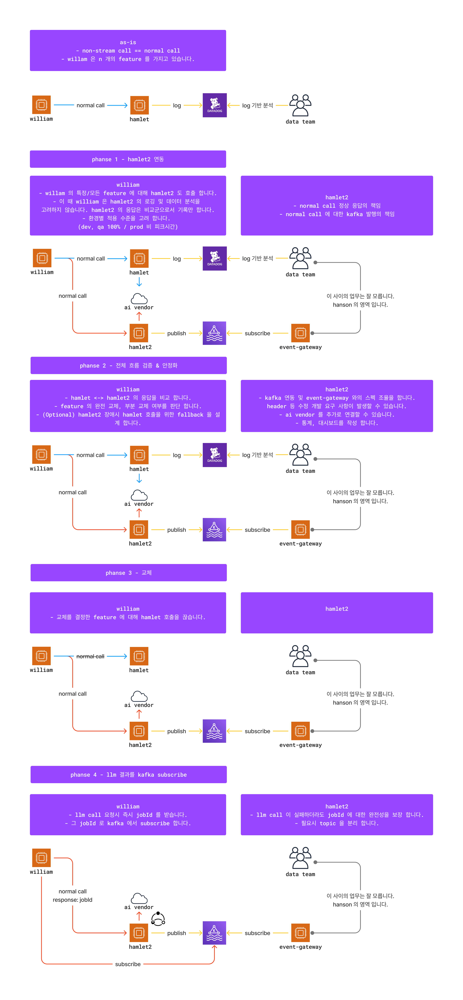
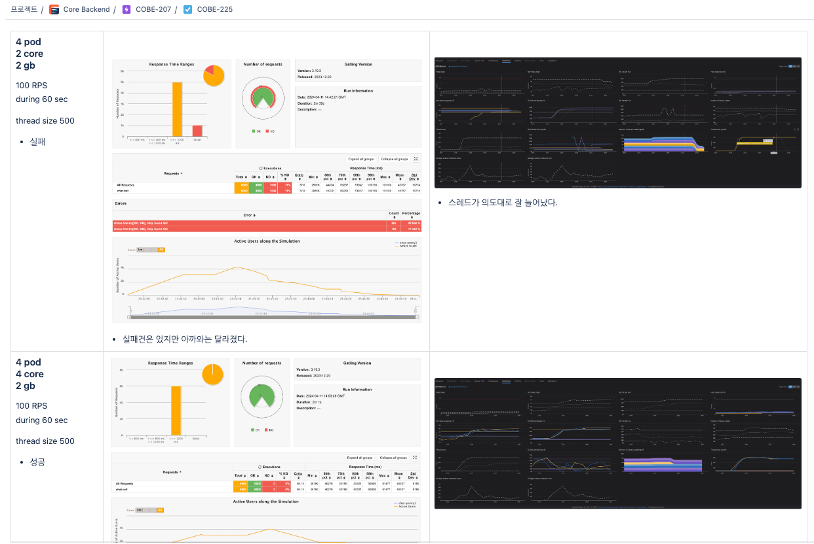
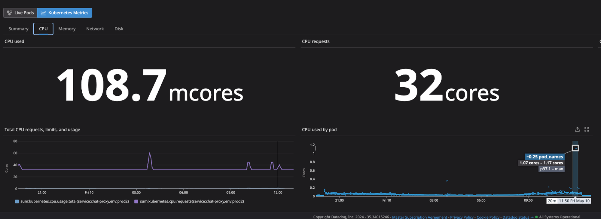
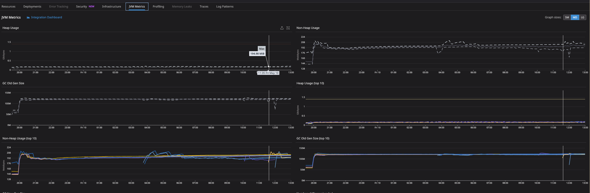
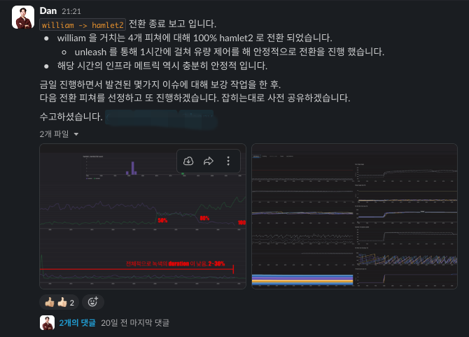

# AI 모델 서빙 서비스 개발, 운영

## 배경 및 역할

AI 모델 서빙 책임을 가진 JVM 기반 서비스 `hamlet2`를 개발하고 운영했습니다.  
기존 Node 기반 `hamlet1` 기능을 무중단으로 교체해야 했기 때문에, 단순 서버 구현뿐 아니라 클라이언트 서비스와 로그 흐름까지 포함해 대상 기능, 아키텍처, 일정, 배포 단계를 조율했습니다.

Spring AI 를 확장해 provider / model 확장성을 확보했고, 전 세계에 흩어진 27개 Azure PTU resource 를 서빙할 수 있도록 구성했습니다.

## 구현

- retry 로직과 AI model call 결과 Kafka publish 흐름을 개발했습니다.
- Micrometer 기반 custom metric 과 Datadog 대시보드를 구성해 관측성을 강화했습니다.
- Gatling 기반 사전 부하 테스트로 적절한 인프라 스펙을 검증했습니다.
- 단계별 전환 계획을 세워 실서비스 기능을 무중단으로 교체했습니다.

### 서비스 적용 계획

개발부터 실 적용까지 유관 부서와 대상 기능, 아키텍처, 전환 일정을 맞추며 phase 단위로 진행했습니다.

### 사전 부하 테스트

Gatling 기반 부하 테스트로 목표 처리량과 인프라 스펙을 사전에 검증했습니다.

## 성과

- RPM 750 수준의 처리량을 달성했습니다.
- 기존 서비스 대비 API response time 을 약 20% 개선했습니다.
- retry 로직과 관측성 개선으로 오류 건 감소와 선제 감지가 가능해졌습니다.
- 뤼튼 메인 화면의 연관링크, 다이내믹칩 서빙에 사용되었습니다.

### Hamlet1 / Hamlet2 비교

가장 많은 유량이 들어온 시간대 기준으로 20분당 15,000건, 약 RPM 750 수준을 처리했고, duration 은 약 20% 개선되었습니다.

### 관측성 개선

AI model 호출 실패와 인프라 부하를 신규 대시보드에서 확인할 수 있도록 구성했습니다.

### 무중단 전환

기존 서비스와 신규 서비스의 전환 구간을 나누어 실서비스 기능을 무중단으로 교체했습니다.

