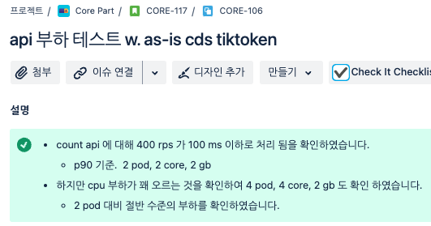
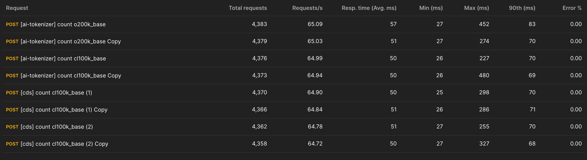

# Tokenizer 서비스 개발, 운영

## 배경

GPT-4o 는 기존 모델과 encoding 방식이 달라 기존 토큰 계산 로직에서 오차가 발생했습니다.

- 토큰 계산은 비용 산정과 사용량 제어에 직접 연결되는 영역이라 빠르게 대응할 필요가 있었습니다.
- OpenAI 공식 token 계산 라이브러리는 Python 기반으로 제공되고 있었기 때문에, Kotlin/JVM 서비스에 억지로 포함하기보다 Python + FastAPI 기반의 별도 Tokenizer 서비스로
  분리했습니다.

## 구현 및 검증

- OpenAI 공식 Tiktokenizer 라이브러리를 사용해 모델별 token 계산을 제공했습니다.
- AI 비용 최적화와 사전 사용량 검증에 필요한 계산 로직을 내부 서비스에서 안정적으로 사용할 수 있도록 구성했습니다.
- 사전 부하 테스트를 통해 RPS 400 수준의 요청 처리와 인프라 스펙을 검증했습니다.

